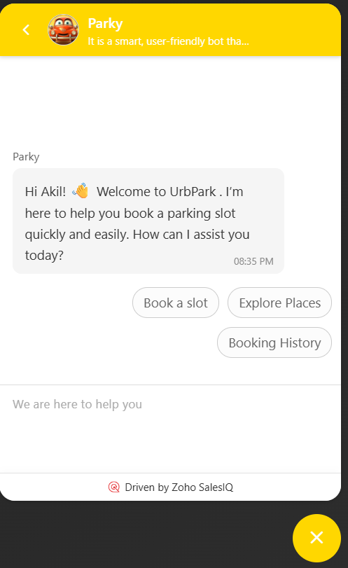
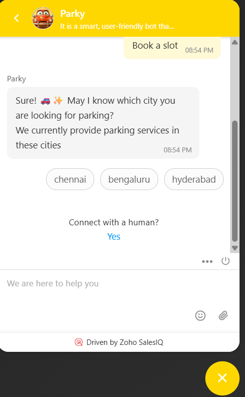
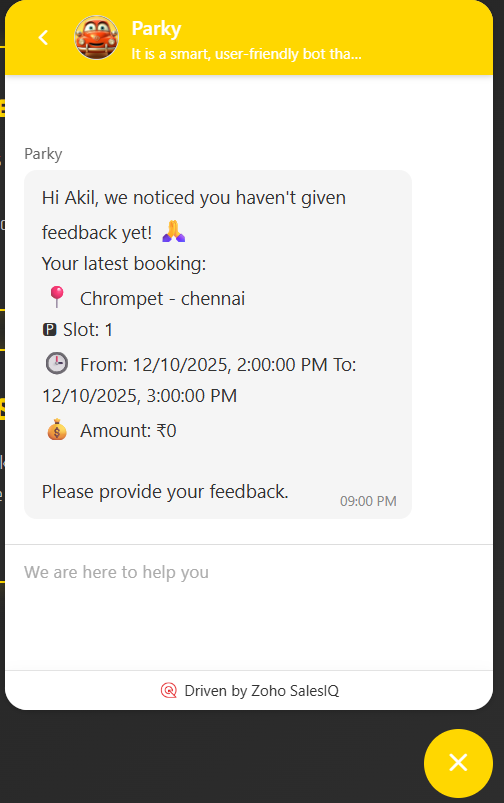
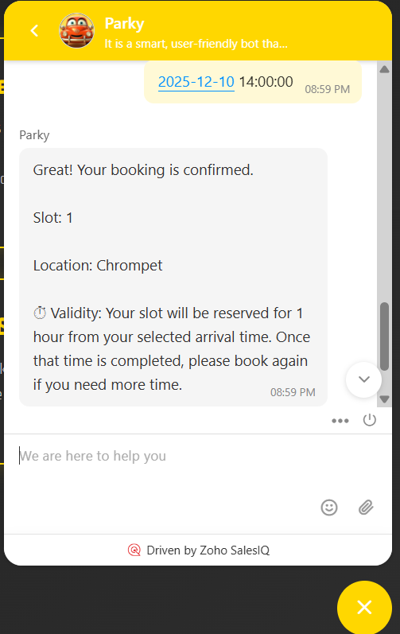

# UrbPark with Parky Bot

## Description
**UrbPark with Parky Bot** is a smart, user-friendly bot that simplifies urban parking. It helps users and guests find, book, and manage parking slots efficiently, saving time, reducing stress, and preventing unauthorized parking for a seamless experience.

---

## Technology Stack
- **Backend:** Node.js, Express.js, PostgreSQL  
- **Bot:** Zoho Zobot using Deluge  

---

## Installation

1. Clone the repository:
```bash
git clone https://github.com/PremnathSundarrajan/Parky__Zobot__Cliqtrix.git
cd Parky__Zobot__Cliqtrix

```
2. Install my-project with npm

```bash
  npm install
  npx prisma generate
  npx prisma migrate dev
  npm run dev
  npm run dev

```
    
---

## Usage/Examples

Once the server is running, you can interact with Parky Bot through the integrated interface.

Example Screenshots

#Bot Home / Dashboard:


#Booking a Slot:



#Feedback Prompt After Booking:



#Automatic Slot Booking:



## Bot Features

- Book a Slot: Reserve a parking slot in real-time.

- Ask for Feedback: Automatically prompts users for feedback after booking.

- Automatic Slot Booking: Suggests and books an available slot automatically.

- Intelligent parking slot booking and management

- Real-time availability updates

- User-friendly interaction via Zoho Zobot

- Feedback collection to improve service
